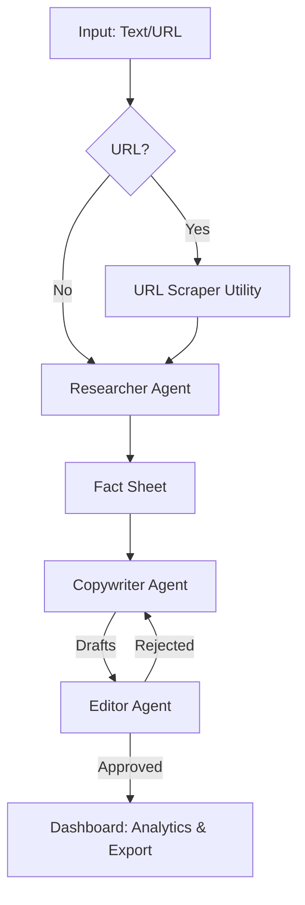

# Approach Document — Autonomous Content Factory

**Author:** Adithyan M S

---

## 1. Solution Design

The Autonomous Content Factory is a **multi-agent orchestration system** that converts raw source material into a complete, multi-channel marketing campaign. The architecture consists of a robust preprocessing layer followed by three specialized AI agents that collaborate to ensure quality and accuracy.

### Core Agent Team

| Agent | Responsibility | Key Action |
|---|---|---|
| **Researcher** | Fact Extraction | Parses raw input to produce a structured "Fact Sheet" (features, specs, audience, value prop). |
| **Copywriter** | Content Generation | Consumes the Fact Sheet to generate a long-form Blog Post, Social Media Thread, and Email Teaser. |
| **Editor** | Quality Assurance | Reviews content against the Fact Sheet. Rejects sub-standard drafts with correction notes for auto-regeneration. |

### Preprocessing Layer
- **URL Scraper**: An automated utility that fetches web pages, strips boilerplate (nav, ads, footers), and extracts the main article content. This runs as an optional Step 0 to prepare the source material for the Researcher.

### Workflow Pipeline

The workflow is fully sequential with an automatic feedback loop. If the Editor rejects a piece, the Copywriter regenerates it (up to 5 times) using the Editor’s specific feedback, ensuring the final output meets all quality standards.

---

## 2. Tech Stack Choices & Rationale

| Choice | Why |
|---|---|
| **Next.js 16 (App Router)** | Unified full-stack framework with built-in API routes and server-side optimizations. |
| **TypeScript** | Strong typing across agents and API contracts ensures a maintainable and bug-free pipeline. |
| **Vercel AI SDK + Groq** | Provides high-speed LLaMA-based inference, keeping the multi-step generation under 60 seconds. |
| **SQLite + Prisma** | Lightweight, zero-config local database. Ideal for a self-contained, high-performance demo. |
| **Tailwind CSS 4** | Advanced design tokens and utility classes for a premium, responsive "glassmorphism" UI. |

---

## 3. Key Features Implemented

### Workflow & Control
- **Intelligent Pre-Validation**: LLM-powered gate blocks low-quality/gibberish input before processing.
- **Tone Customization**: Pre-select 6 distinct tones for each platform (Blog, Social, Email) before starting the campaign.
- **Multi-Language Support**: Complete pipeline support for 10 languages (English, Spanish, French, German, Italian, Portuguese, Hindi, Japanese, Korean, Chinese).
- **Inline Editor**: Fully-featured manual text editor within the studio for fine-tuning approved drafts.

### User Interface & Experience
- **Live Logs**: Compact, status-coded communication feed (🟢 Approved, 🔴 Rejected, 🟡 Creating, 🟠 Reviewing).
- **Analytics Dashboard**: Real-time metrics including reading grade level, word count, estimated read time, and SEO keyword extraction.
- **Advanced Export**: Export the full campaign as a **Styled HTML** page (print-ready) or a **ZIP Archive** with individual text files.
- **Browser Notifications**: Native alerts fire when a campaign finishes, even if the tab is in the background.

### Architecture Decisions
- **In-Memory Store**: Language and tone settings are persisted in a high-speed in-memory map to ensure they survive the regeneration loops without complex DB schema changes.
- **SSE + Polling**: Real-time dashboard updates use Server-Sent Events with a 2-second polling fallback for maximum reliability.

---

## 4. What I Would Improve With More Time

- **Streaming responses** — Token-by-token output for a more "alive" generation feel.
- **User authentication** — Secure accounts for managing multiple independent campaign histories.
- **Production Deployment** — Migration to PostgreSQL and Vercel for public-facing availability.
- **PDF Export** — Direct-to-PDF generation for the Export Center.

---

